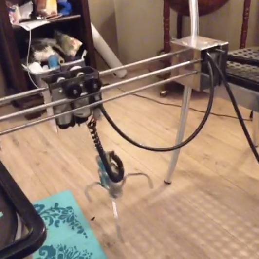

# The CLAW

This is the source code for an Arduino controlled mechanical claw machine. 
Its written with javascript and nodejs to run in a browser, and to control the
machine from a computer. It uses websockets in order to have direct response on
the machine, and binds the keyboard arrow keys keyup/keydown to toggle power
activation.
This makes it easier to integrate with some other scripts you can include a
top-down-webcam to the claw. Or to share it online via a website.

The Arduino was connected to some relais, which were connected to the engines
in the mechanical claw. You can use the arrow keys to move the thing around.

On the claw were some switches activating an electric current. These could be
used to detect whether:
- There is load on the claw (if you reach the bottom, the claw becomes
    weightless).
- Whether you reached the top of the wire.
- Reaching the end of the YZ axis.

# Future features
- Analog speed control to gently increase the velocity by time
- Multiplayer support
